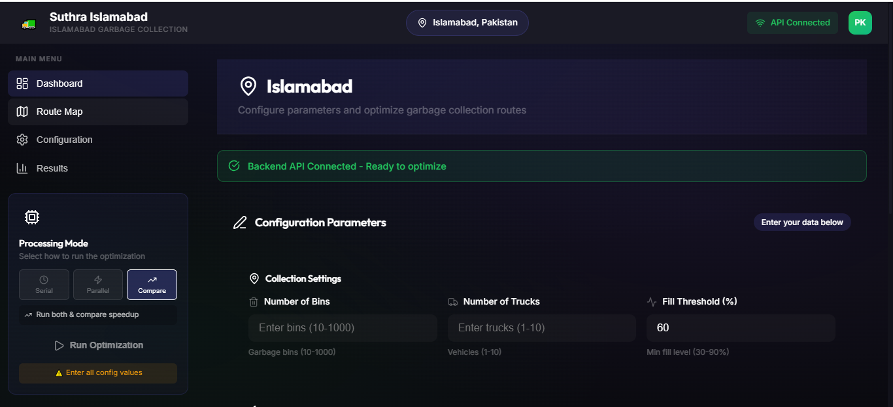
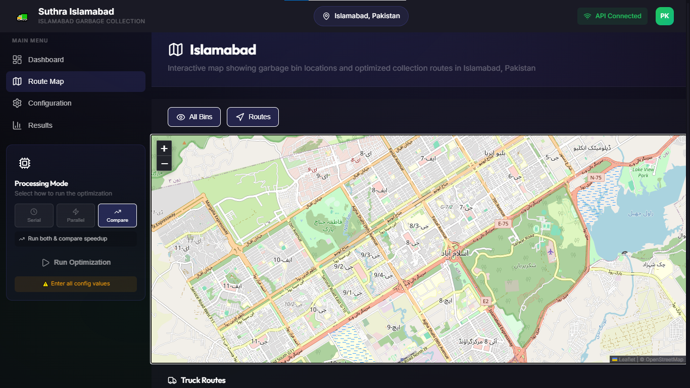
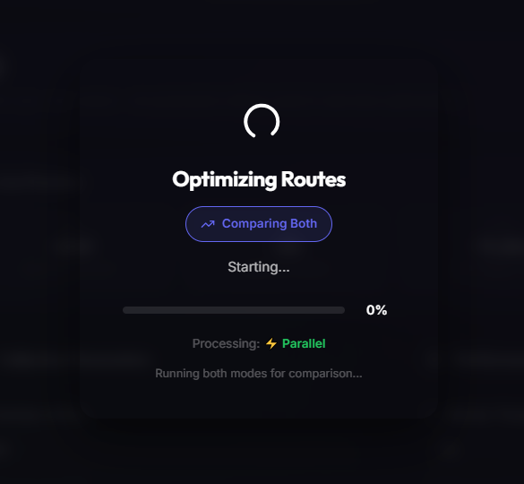
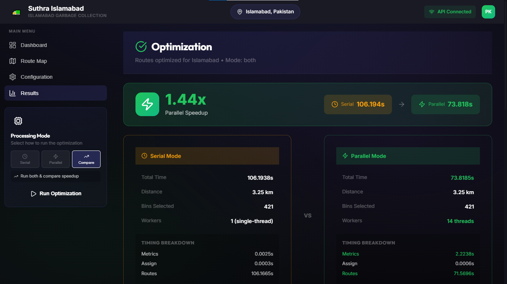
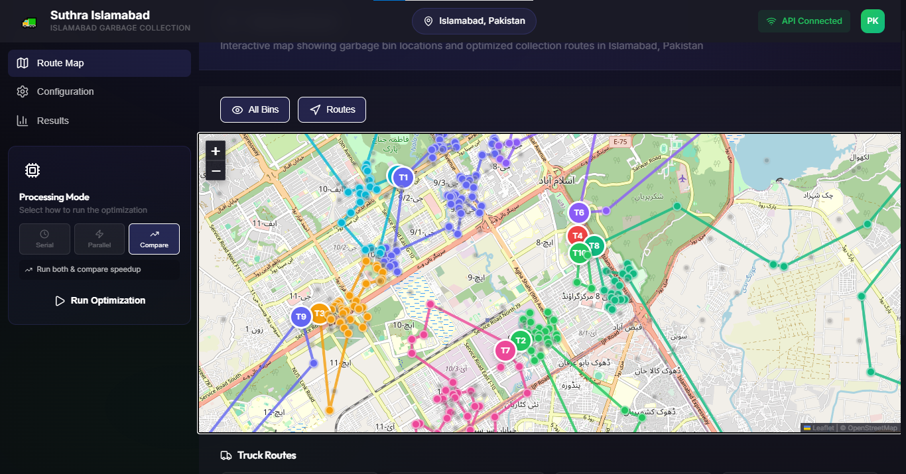
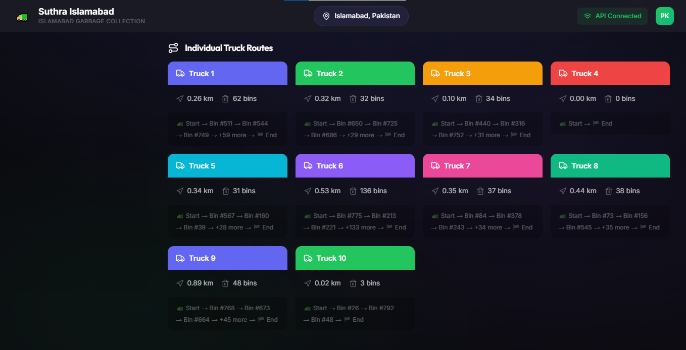

# 🚛 Suthra Islamabad - Garbage Collection Route Optimization System

> **A High-Performance Parallel Computing Visualizer & Simulator for Urban Waste Management**

Suthra Islamabad is a cutting-edge, premium full-stack dashboard designed to simulate and optimize real-world garbage collection routes across Islamabad, Pakistan. Built as a benchmark platform, it demonstrates the tangible speedup and performance gains of **Parallel Processing** versus traditional **Serial Computing** when solving complex NP-hard Vehicle Routing Problems (VRP) in real-time.

---

## 🚀 Parallel vs. Serial Computing: Core Educational Value

At its heart, **Suthra Islamabad** is a practical laboratory for understanding high-performance parallel computing. By simulating waste management across hundreds of bins and multiple vehicles, it isolates and visualizes how multi-threading solves computationally heavy tasks.

### 🔍 How the System Teaches Parallel Concepts

This project divides the optimization process into distinct phases, each comparing **Serial (Single-Threaded)** and **Parallel (Multi-Threaded)** execution:

1. **Massive Metric Calculation (Bin Priority & Proximity Matrix)**
   * **Serial**: Iteratively computes Euclidean distances, cluster allocations, and urgency scoring (based on fill levels and proximity) for each bin one-by-one on a single CPU core.
   * **Parallel**: Leverages Python's multi-processing capabilities to distribute bin coordinate blocks across all available CPU worker threads. For large datasets (e.g., 1000+ bins), parallel computing reduces this step from seconds to milliseconds.
   
2. **Combinatorial Candidate Route Generation & 2-Opt Refinement**
   * **Serial**: The greedy heuristic and randomized 2-opt route reversal algorithms evaluate millions of route ordering permutations sequentially for each truck.
   * **Parallel**: Assigns distinct vehicle routes to different CPU workers, executing route local search algorithms in parallel. The dashboard displays the real-time throughput difference.

3. **Performance Diagnostics Dashboard**
   * Computes **Speedup ($\mathcal{S} = T_{\text{serial}} / T_{\text{parallel}}$)** and efficiency metrics in real-time.
   * Provides deep breakdown diagnostics, illustrating exactly where parallel computing shines (heuristics, large-scale loops) and where thread-spawning/inter-process communication overhead occurs.

---

## 🎨 Visual Application Tour

Below is the step-by-step workflow of **Suthra Islamabad** in action:

### 1. The Control Center (Configuration)
Configure problem sizes (up to 1,000+ bins), the fleet size, thresholds, and parallel CPU worker thread counts. Select **Compare** mode to run the serial and parallel algorithms side-by-side.



### 2. Map Initialization (Islamabad, Pakistan)
An interactive geographic map covering Islamabad's sectors, showing depots and truck terminals.



### 3. Real-Time Benchmarking Process
When optimization is initiated, the system runs both engines sequentially and concurrently. You can track parallel processing updates in real-time.



### 4. Parallel Speedup & Performance Breakdown
Upon completion, the dashboard highlights the **Speedup Multiplier** (e.g., **1.44x faster** utilizing multi-threading) alongside precise execution times for metrics calculation, routing, and bin assignment.



### 5. Highly Optimized Routes Map
Visualizes the final optimized routes on the map. Bins are partitioned into spatial clusters, and polyline paths represent the optimal travel sequence for each collection vehicle.



### 6. Individual Vehicle Waypoint Sequences
Detailed breakdown cards for each truck, showing total path distance, assigned bin counts, and the precise waypoint visit sequence.



---

## 📋 What this project does

Given a set of garbage bins (with fill levels) and a set of trucks (depots), the backend:

1. Generates bins and trucks (API uses Islamabad lat/lng data; CLI can generate synthetic grid data)
2. Selects only bins above a fill threshold
3. Assigns each selected bin to a truck
4. Builds a route (visit order) per truck and improves it using a 2‑opt local search
5. Returns per-truck routes, total distance, and timing metrics


Parallel mode accelerates:

- Per-bin metric computation (distance/priority)
- Candidate route evaluation per truck

## Repository structure (high level)

```
frontend/                 React + Vite UI
pdc_garbage_routes/       Python backend (API + CLI)
    api_server.py           Flask API server
    main.py                 CLI runner
    src/                    Core algorithm modules
    tests/                  Basic unit tests
build.sh                  Render build script
render.yaml               Render deployment blueprint
```

## Run locally (recommended: full stack)

Prerequisites:

- Python 3.10+ (3.11+ recommended)
- Node.js 18+

Terminal 1 — backend API:

```bash
cd pdc_garbage_routes
python -m pip install -r requirements.txt
python api_server.py
```

Terminal 2 — frontend:

```bash
cd frontend
npm install
npm run dev
```

Open:

- Frontend: http://localhost:5173
- Backend health: http://localhost:5000/api/health

## Run locally (CLI only)

```bash
cd pdc_garbage_routes
python -m pip install -r requirements.txt
python main.py
```

Windows demo script:

```bat
cd pdc_garbage_routes
scripts\run_demo_windows.bat
```

CLI outputs (generated under `pdc_garbage_routes/output/`):

```
output/
    serial/route_map.png
    parallel/route_map.png
    comparison.html
```

## How routing works (implementation summary)

The main scoring/optimization ideas are implemented in:

- `pdc_garbage_routes/src/parallel_module.py` (metrics, assignment, candidate routes)
- `pdc_garbage_routes/src/routing.py` (greedy routing and 2‑opt improvement)

### Bin selection (threshold)

Bins are filtered by fill level:

- Selected bins: `fill >= threshold`

### Assignment and priority scoring (alpha/beta)

For each selected bin, the code finds its nearest truck and computes a priority:

```
priority = alpha * (fill/100) + beta * (1/(nearest_distance + 1))
```

Then each bin is assigned to the nearest truck; bins inside each truck “bucket” are sorted by priority.

### Route construction (greedy) + improvement (2‑opt)

For each truck bucket:

- A greedy route is built by repeatedly picking the next bin with a high `(priority / (distance + 1))`
- The route is improved using 2‑opt: it tries reversing segments to reduce route length

### Candidate routes (route candidates)

If `candidates > 1`, the solver generates additional randomized candidate routes per truck, improves each with 2‑opt, and keeps the shortest route.

## Configuration parameters (meaning + effect)

The UI and API accept these keys (CLI flags shown where available). The most important ones:

| Parameter | UI / API key | CLI flag | Purpose | What happens if you increase it |
|---|---|---|---|---|
| Number of bins | `bins` | `--bins` | Problem size (how many bins exist) | More bins selected/assigned → longer routes and slower runtime |
| Number of trucks | `trucks` | `--trucks` | How many routes (vehicles) exist | Usually fewer bins per truck and cleaner partitioning; total distance often drops, runtime can vary |
| Fill threshold (%) | `threshold` | `--threshold` | Which bins get collected (`fill >= threshold`) | Fewer bins selected → shorter distance and faster runtime (but collects less) |
| Route candidates | `candidates` | `--candidates` | How many alternative route orderings are tried per truck | Better chance of shorter routes, but more compute time |
| 2‑opt iterations | `max_2opt` | `--max-2opt` | How long the 2‑opt improvement runs | Often improves distance, but can be much slower for large routes |
| Workers | `workers` | `--workers` | Parallel processes used in parallel mode | Faster parallel runs up to CPU limits; too high can add overhead |
| Mode | `mode` | `--mode` | `serial`, `parallel`, or `both` | `both` runs and compares two modes |
| Alpha (α) | `alpha` | `--alpha` | Weight for fill contribution in priority | Higher α favors fuller bins more strongly |
| Beta (β) | `beta` | `--beta` | Weight for proximity contribution in priority | Higher β favors nearer bins more strongly |

Notes:

- Increasing `candidates` and `max_2opt` improves route quality at the cost of runtime.
- Increasing `trucks` reduces bins per route but adds more “return to depot” legs.
- In API mode, the seed is derived from some inputs, so changing values may also change the generated scenario.

## API (when running `pdc_garbage_routes/api_server.py`)

Endpoints:

- `GET /api/health`
- `GET /api/config/defaults`
- `GET /api/system/info`
- `GET /api/city/info`
- `POST /api/optimize`
- `GET /api/progress`
- `GET /api/results`

The backend returns route data as ordered waypoints per truck, plus distance/time metrics.

## Tests

```bash
cd pdc_garbage_routes
python -m unittest
```

## Deployment (Render)

This repo includes a Render blueprint:

- `render.yaml` runs `build.sh` to build the React frontend and install Python deps
- The service starts via `gunicorn api_server:app ...`

In production builds, the frontend uses `/api` (relative) as the API base path, and the Flask app serves the built frontend from `frontend/dist/`.

## Limitations (important for interpretation)

- This is a heuristic solver (greedy + 2‑opt + randomized candidates), not an exact VRP optimizer.
- Bin-to-truck assignment is based on nearest truck (with priority used for ordering), not a full global optimization across all trucks.

## License

No license file is included in this repository.
